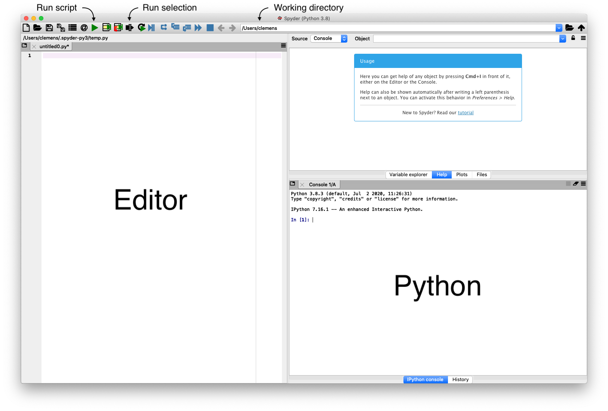

2 - Python Environment
======================
Components
----------
Python consists of the Python programming language, a Python interpreter (which is a program that can interpret and run Python code), and an extensive standard library. The reference (official) Python interpreter is written in the C programming language and is therefore called [CPython](https://github.com/python/cpython).


The Python programming language includes only relatively few keywords and built-in functions. However, the [standard library](https://docs.python.org/3/library/) vastly extends the core functionality such as additional data types, input/output, regular expressions, mathematical functions, data compression, Internet data handling, multimedia services, graphical user interfaces, and so on.

Furthermore, Python can be extended with third-party packages that are not part of the official Python distribution. Installing these packages is straightforward, because they are available from a central repository called the [Python Packaging Index (PyPI)](https://pypi.org). We will discuss how to install, update, and uninstall third-party packages later in this chapter.

As for any programming language, a good text editor is also an essential component for writing Python scripts. Good text editors include support for syntax highlighting, indentation, line numbers, code inspection, and more. For this reason, I recommend that you do not use the simple editors that come with Windows (Notepad) or macOS (TextEdit). Similarly, office suites such as Microsoft Office or LibreOffice are not suitable for programming. Instead, install and use one of the following text editors (all of them are free, open source, and available on Windows, macOS, and Linux):

- [Visual Studio Code](https://code.visualstudio.com)
- [Atom](https://atom.io)
- [Spyder](https://www.spyder-ide.org)
- [PyCharm](https://www.jetbrains.com/pycharm/)

We will use Spyder in this workshop, mainly because it comes pre-installed with Anaconda. In addition to a fully featured editor, Spyder boasts many useful features such as an integrated console running the Python interpreter, a comprehensive help system, and more. However, feel free to try out alternative editors and choose the one that best suits your needs.



Getting help
------------
One of the most important activities when programming is reading documentation. Besides running a search query through your favorite web search engine, the Python interpreter can display short help texts for many Python commands. For example, to view the documentation for the `print` function, you can type `help(print)` in the Python interpreter. Spyder includes an enhanced Python interpreter called [IPython](https://ipython.org), which supports the much shorter syntax `?print` or `print?`. Alternatively, you can press Ctrl&nbsp;+&nbsp;I (&#8984;&nbsp;+&nbsp;I on macOS) to display the help text in the integrated Spyder help window.


Anaconda
--------
Even though Anaconda includes many useful packages out of the box, it is still necessary to install additional packages once in a while. Conversely, you might want to uninstall packages that you don't need anymore to save some space. Finally, it is generally a good idea to keep all Anaconda packages up to date, because package maintainers fix bugs and add new features over time.

All these tasks can be performed with the `conda` command line tool, which is part of every Anaconda distribution. We will explore how `conda` performs important package management tasks, but to get started we need to open a terminal. This works slightly differently depending on which operating system you use:

- On Windows, open the "Anaconda Prompt" shortcut from the start menu.
- On macOS, open the "Terminal" app.
- On Linux, open the standard terminal program.

A terminal is a program that runs a shell which interprets commands to control the system. This is similar to the Python interpreter, but note that both the terminal and specifically `conda` are *not* Python &ndash; these tools are just necessary to manage an Anaconda Python distribution.

Let's test if you can successfully run the `conda` tool. In the terminal, type:

```
conda --version
```

This command should display the `conda` version. If it results in an error message, something is wrong with the Anaconda installation (in this case, consult the [installation instructions](https://docs.anaconda.com/anaconda/install/) to fix the problem).

It is useful to know which packages are installed in our Anaconda distribution. We can use the following command to find out:

```
conda list
```

This will generate a list of all installed packages, including their names and versions. If you want to know if a specific package is installed, you can append the package name to the command (replace `<package_name>` with the real name of the package):

```
conda list <package_name>
```

If the package is installed, the output will include a row with this package. If it is not installed, the output will be empty.

Before installing a new package, we need to know if it is available in Anaconda (note that we need to know the package *name*, otherwise we can't query and install a package). Use the following command to find out if a package named `<package_name>` is available:

```
conda search <package_name>
```

If the search returns results, you can install that package with:

```
conda install <package_name>
```

We will see what to do in case `conda` does not find the package in a moment.

It is straightforward to uninstall a package:

```
conda uninstall <package_name>
```

Finally, one of the most important commands keeps the Anaconda distribution up to date:

```
conda update --all
```

It is good practice to run this command on a regular basis (for example, once a month).

---
 This document is licensed under the [CC BY-NC-SA 4.0](https://creativecommons.org/licenses/by-nc-sa/4.0/) by Clemens Brunner.