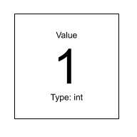
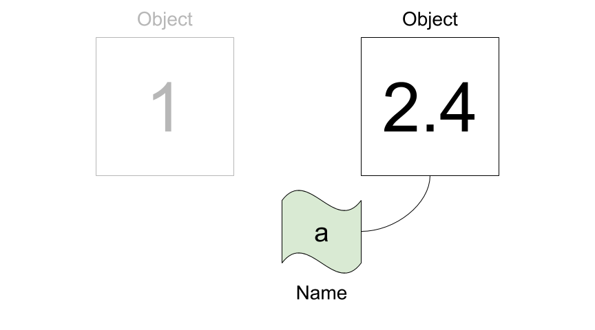
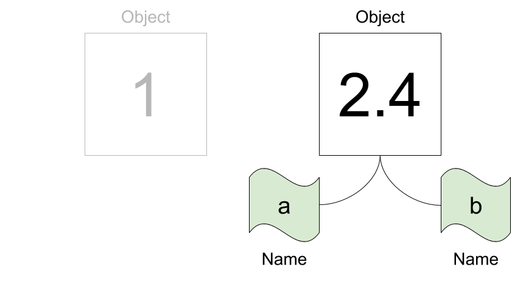

Names, expressions, statements
==============================
Objects, values, and types
--------------------------
In Python, everything is an object. Every object has a value and a type. For example, the number `1` we used in our arithmetic calculations is an object. It has the value `1` and is of type `int` (which means integer number). Here are a few examples that can be entered in the interactive interpreter:

```python
>>> 1
1
```

```python
>>> 2.15
2.15
```

```python
>>> "Hello world!"
'Hello world!'
```

```python
>>> '3'
'3'
```

As we already know, Python outputs the value of the last command automatically. That's why we know the value of the `1` object is `1`, and the value of the `"Hello world!"` object is `"Hello world!"`.

To find out the type of a given object, we can use the `type` function as follows:

```python
>>> type(1)
int
```

```python
>>> type(2.15)
float
```

```python
>>> type("Hello world!")
str
```

```python
>>> type('3')
str
```

Apparently, whole numbers are of type `int` (integer number), decimal numbers are `float` (floating point number), and character strings are `str` (string).

Conceptually, we can think of an object as a Python entity of a specific type with a specific value:



Names
-----
Objects can have names, in other programming languages names are referred to as variables. We can assign a name to an object with the assignment operator `=`, for example:

```python
>>> a = 1
```

This attaches the name `a` to the object `1` (of type `int`). We can visualize names as tags or labels attached to an object.


Python lets us reassign an existing name to a different object.

```python
>>> a = 2.4
```



An object can have more than one name attached to it:

```python
>>> b = a
```



The type of a name corresponds to the type of the object the name is attached to:

```python
>>> type(a)
float
>>> type(b)
float
```

Choosing names
--------------


---
 This document is licensed under the [CC BY-NC-SA 4.0](https://creativecommons.org/licenses/by-nc-sa/4.0/) by Clemens Brunner.